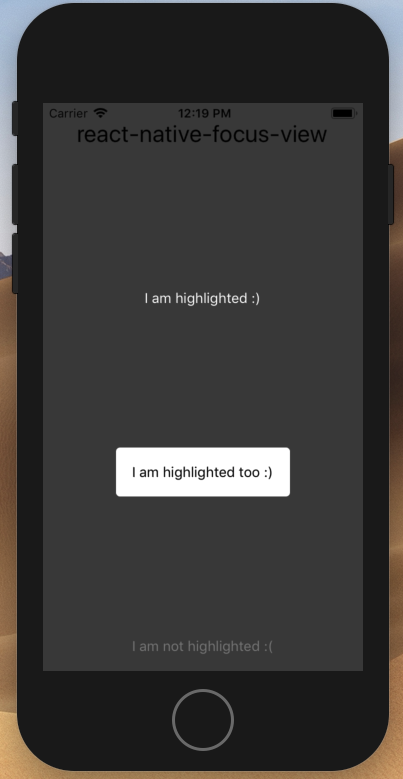

react-native-spotlight
-----------------------

Library that helps you implement highlighting UI elements on on-boarding screen
If you looking for library for implementing onboarding out-of-the box check [react-native-onboarding-view](https://github.com/lamantin-group/react-native-onboarding-view)



Install
-------

Clone repository in development folder (it is created automatically)
```bash
npm install --save react-native-spotlight
```
or
```bash
yarn add react-native-spotlight
```

Example
-------

```js
import { Shadow, Spotlight } from 'react-native-spotlight'

render() {
  return (
    <View>
      {/** Put it in any place for enable shadow background */}
      <Shadow
        color="#000" // optional: color of shadow
        opacity={0.5} // optional: shadow opacity (0 - transparent, 1 - full colored)
      />

      {/* Wrap needed component in Spotlight */}
      <Spotlight>
        <Text style={{ color: '#fff' }}>I am highlighted :)</Text>
      </Spotlight>

      {/* Can be wrapped complicated custom components */}
      <Spotlight>
        <View style={{ padding: 16, backgroundColor: 'white', borderRadius: 4 }}>
          <Text>I am highlighted too :)</Text>
        </View>
      </Spotlight>

      <Text style={{ color: '#fff' }}>I am not highlighted :(</Text>
    </View>
  )
}
```

If you have a question or need specific feature, feel free to [open an issue](https://github.com/lamantin-group/react-native-spotlight/issues/new) or create pull request.

---

```
The MIT License

Copyright (c) 2010-2019 Lamantin Group, LTD. https://lamantin.group

Permission is hereby granted, free of charge, to any person obtaining a copy
of this software and associated documentation files (the "Software"), to deal
in the Software without restriction, including without limitation the rights
to use, copy, modify, merge, publish, distribute, sublicense, and/or sell
copies of the Software, and to permit persons to whom the Software is
furnished to do so, subject to the following conditions:

The above copyright notice and this permission notice shall be included in
all copies or substantial portions of the Software.

THE SOFTWARE IS PROVIDED "AS IS", WITHOUT WARRANTY OF ANY KIND, EXPRESS OR
IMPLIED, INCLUDING BUT NOT LIMITED TO THE WARRANTIES OF MERCHANTABILITY,
FITNESS FOR A PARTICULAR PURPOSE AND NONINFRINGEMENT. IN NO EVENT SHALL THE
AUTHORS OR COPYRIGHT HOLDERS BE LIABLE FOR ANY CLAIM, DAMAGES OR OTHER
LIABILITY, WHETHER IN AN ACTION OF CONTRACT, TORT OR OTHERWISE, ARISING FROM,
OUT OF OR IN CONNECTION WITH THE SOFTWARE OR THE USE OR OTHER DEALINGS IN
THE SOFTWARE.
```